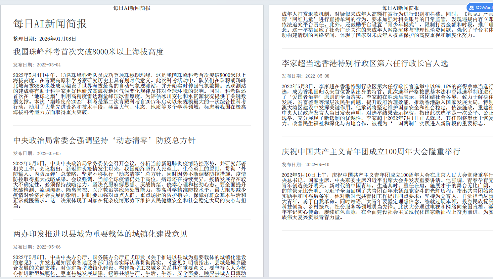

# 概述
第一版仅支持代码生成pdf，后续有时间会完成规划中的任务。

这是一款可以收集新闻、并生成pdf的工具，支持docker构建运行，支持pc、手机端自适应，支持api模式访问，支持将收集的新闻生成html，生成的模板也支持调整，且模板可使用css美化。



# 安装使用
建议在虚拟环境下使用，不影响现有环境，推荐使用uv。
```cmd
# 使用uv
uv pip install -r requirements.txt
```
```cmd
# 不使用uv
pip install -r requirements.txt
```

如果是windows的话，还需要额外安装这个exe：https://github.com/tschoonj/GTK-for-Windows-Runtime-Environment-Installer/releases

之后还需要更改config/models中的模型（需要模型可联网搜索，如：qwen-plus-search等），更改可用的模型即可，支持自定义模式服务商base_url。

## 使用
```commandline
pythion main.py
```
或者用pycharm直接run即可

## 规划

### web访问

#### 需要支持pc、mobile自适应

### 常驻进场

#### 方便处理异步任务

### 提供api接口访问

#### 使用fastapi

### docker容器化
方便迁移和部署

### 支持工具调用搜索，就不依赖模型的联网搜索能力

### 支持搜索任意内容 并导出pdf